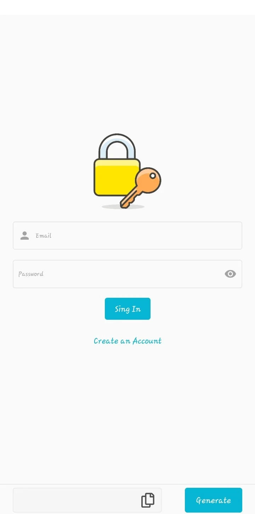
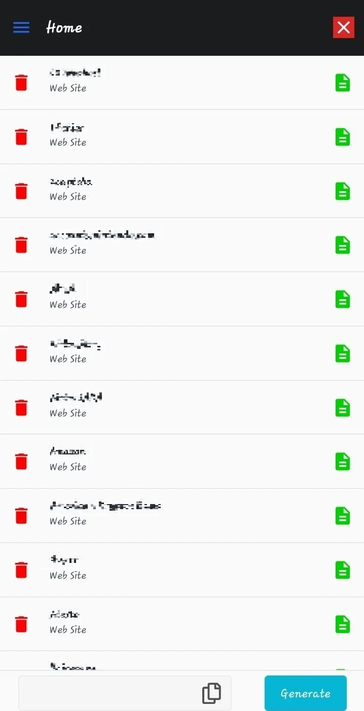
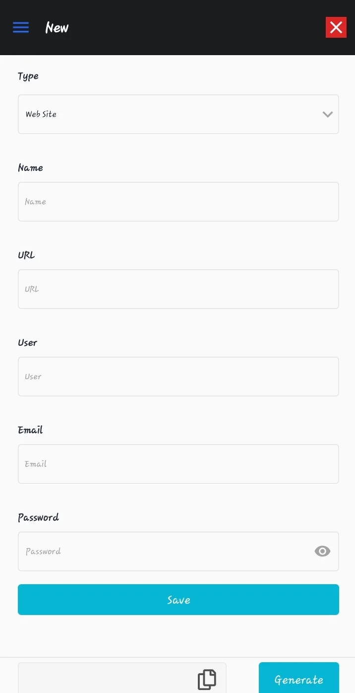
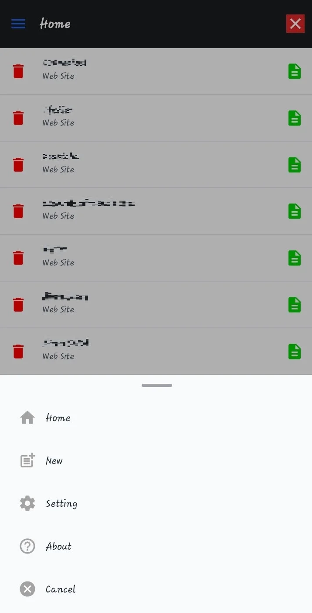

# PassWallet!

PassWallet is an application created with the purpose of storing in a secure and centralized way the passwords of the online accounts that you can have in different websites and more.

- The passwords are stored in Firebase with AES encryption from the client so it cannot be seen by any other user.

- The account cannot be recovered and the information cannot be decrypted without the login password.

- The password can be changed as long as you have the login password.

- All information can be deleted with the login password.

- The application includes a 12-digit random password generator that includes both lowercase and uppercase alphanumeric characters, numbers and symbols.

- The stored information can be modified and not all fields are mandatory.

**Author:** Marco

---

# PassWallet

PassWallet es una aplicación crea con la finalidad de almacenar de manera segura y centralizada las contraseñas de las cuentas online que se pueden tener en diferentes sitios webs y más.

- Las contraseñas son almacenadas en Firebase con el cifrado AES desde el cliente por lo que no podrá ser visto por ningún otro usuario.

- La cuenta no puede ser recuperada y la información no puede ser descifrada sin la contraseña de inicio de sesión.

- La contraseña puede ser modificada siempre que se tenga la contraseña de inicio de sesión.

- Se puede eliminar toda la información con la contraseña de inicio de sesión.

- La aplicación incluye un generador de contraseñas aleatorias de 12 cifras que incluyen caracteres alfanúmeros tanto minúsculas como mayúsculas, números y símbolos.

- La información almacenada puede ser modificada y no todos los campos son obligatorios.

**Autor:** Marco

---
## **Application view**
- _Login:_

- _Dashboard:_

- _New Data:_

- _Menu:_

---
---
---
# Getting Started with Expo
### `expo start`
